# Flow Backend Sistem Plagiarism Checker

Dokumen ini memetakan alur backend yang sedang berjalan di kode saat ini. Rujukan utamanya adalah `backend/app/main.py`, `backend/app/routes/*`, `backend/app/services/*`, dan `backend/app/models/schemas.py`.

Catatan penting: backend saat ini belum memakai tabel `document_chapters`. Hasil sumber dan matching text sudah disimpan di `similarity_results` dan `similarity_matches`. Repositori kampus direpresentasikan oleh semua data di tabel `documents`, lalu dokumen target dan dokumen milik user yang sama dikecualikan saat pengecekan repositori.

---

## 1. Arsitektur Backend Saat Ini


---

## 2. Startup Backend

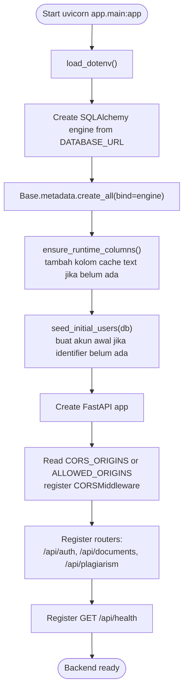

---

## 3. Model Data Backend Saat Ini

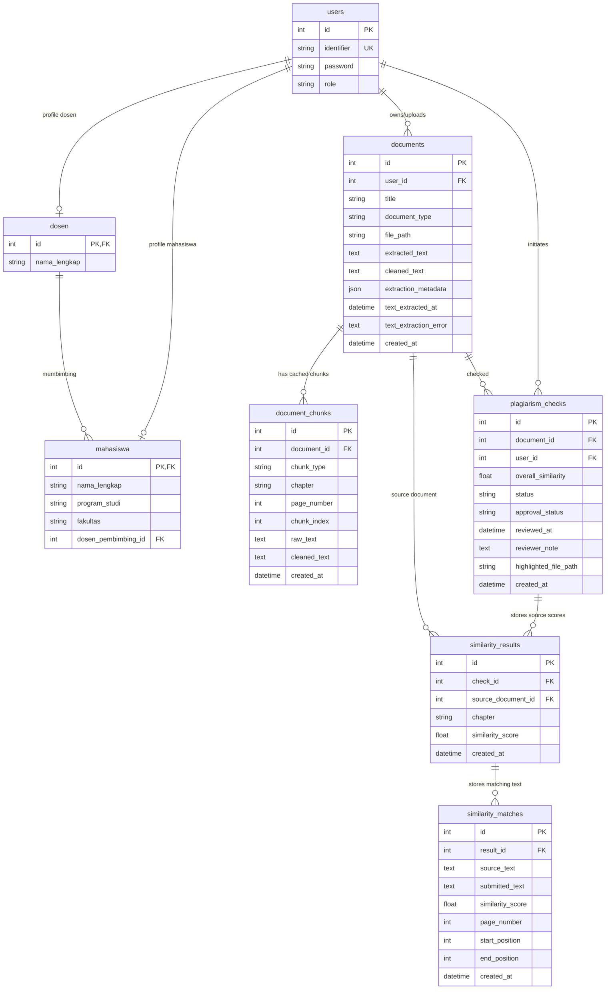

Status yang dipakai saat ini:

- `PlagiarismCheck.status`: umumnya langsung `completed`.
- `approval_status`: default `belum disetujui`, lalu dapat berubah menjadi `disetujui` atau `revisi`.

---

## 4. Alur Autentikasi

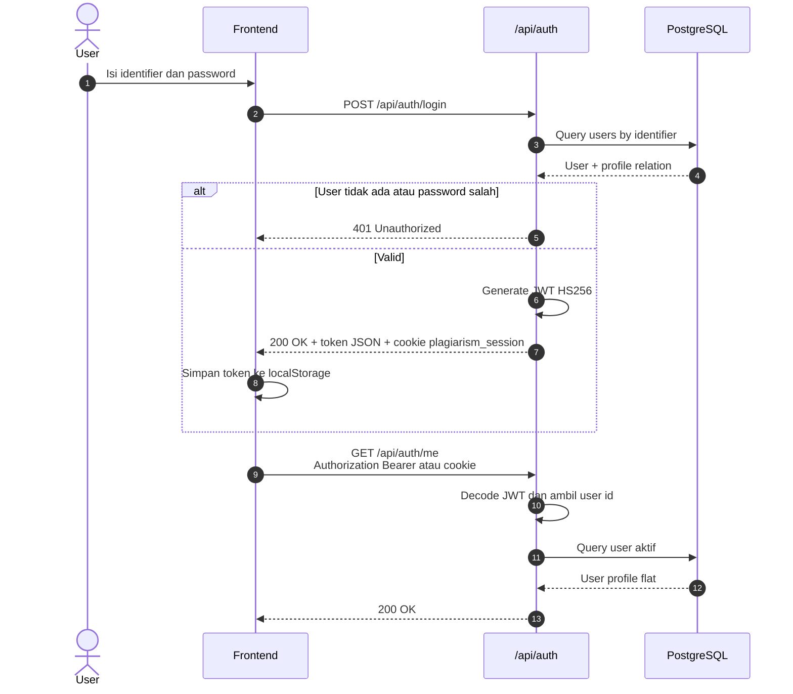

Helper auth:

- `get_current_user`: wajib login, membaca Bearer token lebih dulu lalu cookie.
- `get_optional_current_user`: mencoba membaca user, tetapi mengembalikan `None` jika tidak valid.
- `require_admin`: hanya role `admin` atau `super_admin`.

---

## 5. Alur Upload Dokumen

Endpoint: `POST /api/documents/upload`

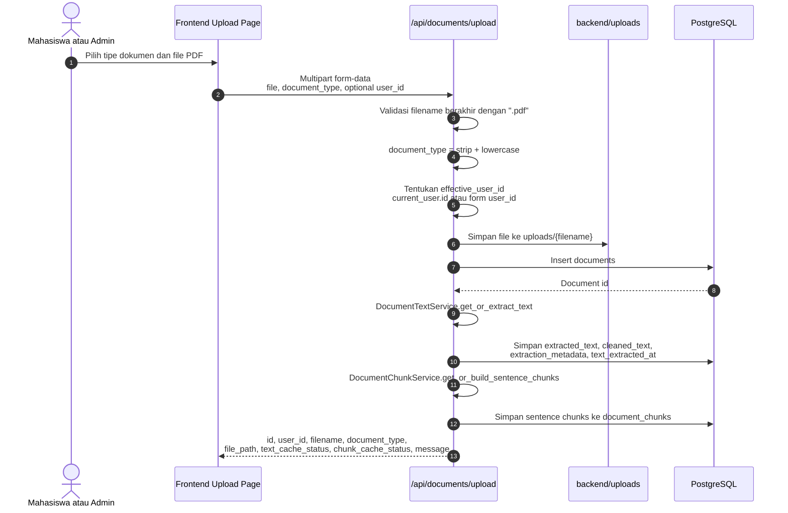

Catatan implementasi saat ini:

- Validasi upload di backend baru memeriksa suffix `.pdf`.
- Nama file asli masih dipakai sebagai nama file di `uploads/`.
- Upload mencoba membuat cache teks dan chunk kalimat langsung. Jika gagal, dokumen tetap tersimpan dan status cache terkait bernilai `failed`.
- Belum ada endpoint backend `GET /api/documents/{id}` di kode saat ini.

---

## 6. Alur Cek Kemiripan Repositori

Endpoint: `POST /api/plagiarism/check-repository/{document_id}`

```mermaid
flowchart TD
    Start([Request check repository]) --> LoadTarget["Query target Document by id"]
    LoadTarget --> TargetFound{"Target ditemukan?"}
    TargetFound -- "Tidak" --> NotFound["404 Dokumen target tidak ditemukan"]
    TargetFound -- "Ya" --> BuildRepo["Query repository documents:<br/>Document.id != target id"]
    BuildRepo --> ExcludeOwner["Jika target_owner_id ada:<br/>exclude Document.user_id == target_owner_id"]
    ExcludeOwner --> HasRepo{"Ada dokumen repo?"}

    HasRepo -- "Tidak" --> EmptyCheck["Create PlagiarismCheck<br/>overall_similarity = 0.0<br/>status = completed"]
    EmptyCheck --> EmptyHighlight["Generate highlighted PDF kosong"]
    EmptyHighlight --> EmptyResponse["Return check_id, 0.0%, matches kosong,<br/>highlighted_pdf_available, chapter_validation"]

    HasRepo -- "Ya" --> ExtractTarget["DocumentTextService.get_or_extract_text(target)"]
    ExtractTarget --> CleanTarget["Ambil cleaned_text target<br/>dari cache atau hasil ekstraksi baru"]
    CleanTarget --> CandidateSearch["RepositoryCandidateService.find_candidates<br/>target chunks vs repo chunks<br/>prioritaskan chapter sama jika tersedia"]
    CandidateSearch --> CandidateDocs["Ambil top-k candidate docs<br/>default candidate_limit = 20"]
    CandidateDocs --> RepoSentences["Ambil candidate reference_corpus<br/>untuk sentence matching"]
    CandidateDocs --> LoopRepo["Loop candidate_docs saja"]

    LoopRepo --> ExtractRepo["DocumentTextService.get_or_extract_text(candidate_doc)"]
    ExtractRepo --> CleanRepo["Ambil cleaned_text repo<br/>dari cache atau hasil ekstraksi baru"]
    CleanRepo --> PairCheck{"Target dan repo punya clean text?"}
    PairCheck -- "Tidak" --> ScoreZero["score = 0.0"]
    PairCheck -- "Ya" --> TfidfDoc["SimilarityService.calculate_clean_text_similarity(target, repo)"]
    TfidfDoc --> CosineDoc["TfidfService + cosine similarity"]
    CosineDoc --> SaveResult["Append result dan update max_score"]
    ScoreZero --> SaveResult
    SaveResult --> MoreRepo{"Masih ada candidate_doc?"}
    MoreRepo -- "Ya" --> LoopRepo

    MoreRepo -- "Tidak" --> SortResults["Sort matches by similarity desc"]
    SortResults --> CreateCheck["Insert plagiarism_checks<br/>overall_similarity = max_score<br/>status = completed"]
    CreateCheck --> SaveResults["Insert similarity_results<br/>untuk setiap source document"]
    SaveResults --> TargetChunks["DocumentChunkService.get_or_build_sentence_chunks(target)"]
    TargetChunks --> SentenceMatch["Run sentence-level matching<br/>target chunks vs repo_sentences_all"]
    SentenceMatch --> SaveMatches["Group by source_document_id<br/>insert similarity_matches"]
    SaveMatches --> Highlight["Generate highlighted PDF<br/>uploads/highlighted/highlighted_check_{id}_*.pdf"]
    Highlight --> UpdateCheck["Update highlighted_file_path"]
    UpdateCheck --> Response["Return highest_similarity_percentage,<br/>matches, total_plagiarized_sentences,<br/>chapter_aware, target_chapters,<br/>highlighted_pdf_available, chapter_validation"]
```

Detail repository check:

- Candidate search memilih top-k dokumen sumber dari `document_chunks` sebelum full document scoring.
- Candidate search memprioritaskan chunk dari BAB yang sama jika `document_chunks.chapter` tersedia.
- Perbandingan dokumen utuh dilakukan hanya terhadap candidate docs.
- Teks dokumen memakai cache `documents.extracted_text` dan `documents.cleaned_text` jika sudah tersedia.
- Matching kalimat memakai cache `document_chunks` jika sudah tersedia.
- `overall_similarity` menyimpan skor tertinggi dari seluruh dokumen repo.
- Source scores disimpan ke `similarity_results`.
- Matching text disimpan ke `similarity_matches`.
- Proses berjalan sinkron di satu HTTP request.

---

## 7. Alur Cek Dua Dokumen Spesifik

Endpoint: `POST /api/plagiarism/check`

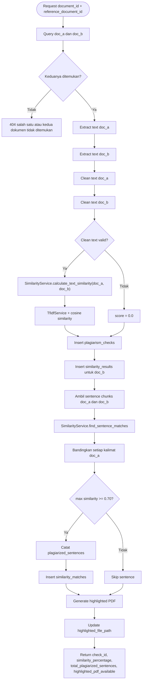

---

## 8. Alur PDFService

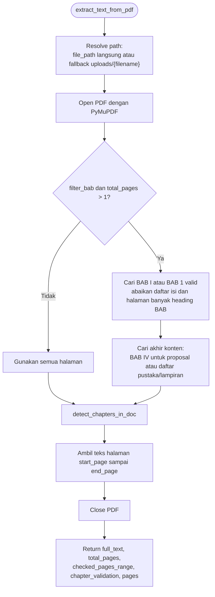

Validasi BAB:

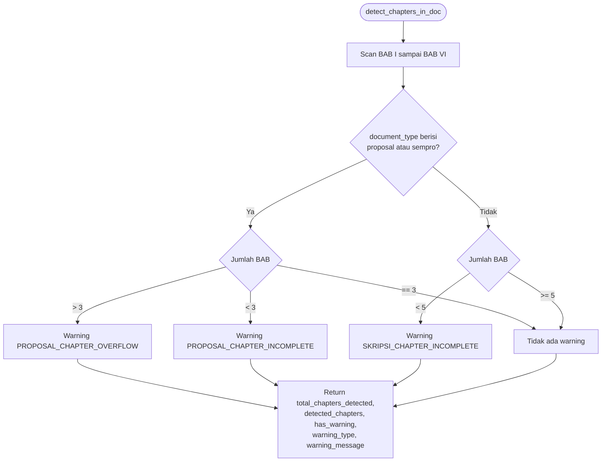

---

## 9. Pipeline Preprocessing

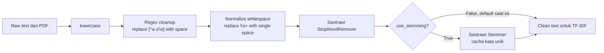

Efek penting pipeline saat ini:

- Angka dan karakter non-alfabet dibuang oleh regex.
- Stemming tersedia, tetapi default `False` dan tidak diaktifkan pada route plagiarism saat ini.

---

## 10. Sentence Matching dan Highlight PDF

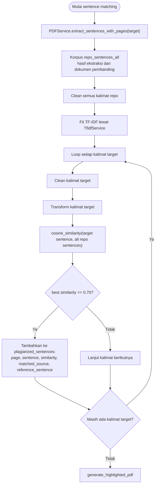

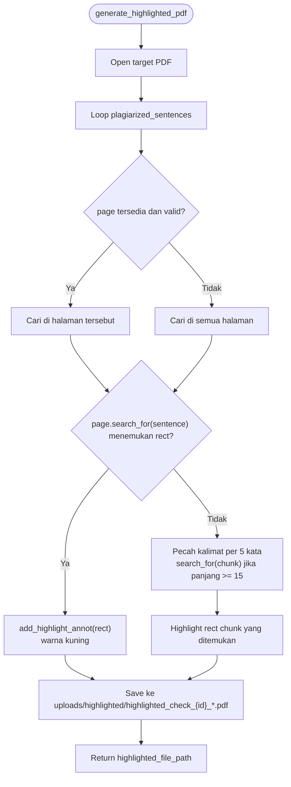

---

## 11. Riwayat, Download, dan Approval

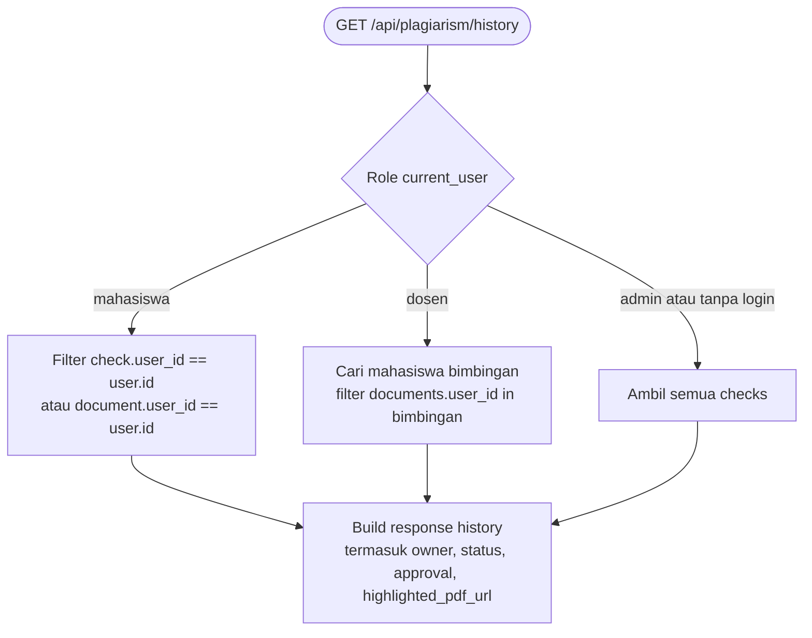

```mermaid
flowchart TD
    Download([GET /api/plagiarism/check/{id}/download-highlighted]) --> LoadCheck["Query PlagiarismCheck"]
    LoadCheck --> Exists{"Check ada?"}
    Exists -- "Tidak" --> NotFound["404"]
    Exists -- "Ya" --> Access{"_can_access_check?"}
    Access -- "Tidak" --> Forbidden["403"]
    Access -- "Ya" --> FileExists{"highlighted_file_path ada di disk?"}
    FileExists -- "Ya" --> Stream["Return FileResponse inline PDF"]
    FileExists -- "Tidak" --> CanFallback{"Dokumen asli ada?"}
    CanFallback -- "Ya" --> GenerateEmpty["Generate highlighted PDF kosong<br/>lalu simpan path"]
    GenerateEmpty --> Stream
    CanFallback -- "Tidak" --> Missing["404 file tidak tersedia"]
```

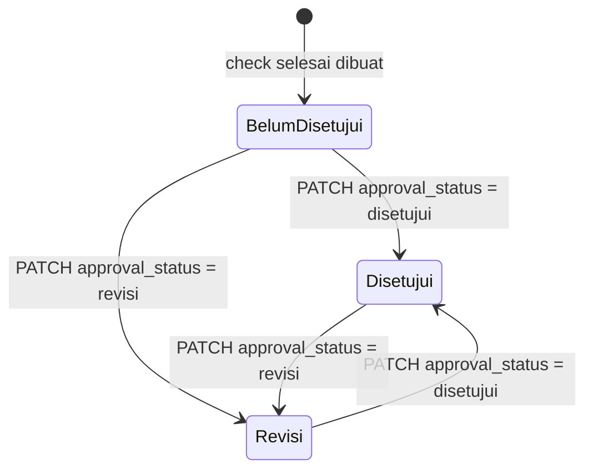

Endpoint approval: `PATCH /api/plagiarism/check/{check_id}/approval`

- Wajib login.
- Body menerima `approval_status` bernilai `disetujui` atau `revisi`, dengan `reviewer_note` opsional.
- Role `dosen` hanya boleh mereview dokumen mahasiswa bimbingannya.
- Role `admin` dan `super_admin` boleh mereview semua.
- Role lain ditolak.

---

## 12. Endpoint API Aktual

| Method | Endpoint | Auth di Kode | Fungsi |
|---|---|---|---|
| `GET` | `/api/health` | Publik | Health check backend |
| `POST` | `/api/auth/login` | Publik | Login, buat JWT, set cookie `plagiarism_session` |
| `GET` | `/api/auth/me` | Wajib login | Ambil profil user aktif |
| `POST` | `/api/auth/logout` | Publik | Hapus cookie session |
| `GET` | `/api/auth/users` | Admin | List user |
| `GET` | `/api/auth/users/dosen` | Admin | List dosen untuk dropdown |
| `POST` | `/api/auth/users` | Admin | Buat user baru |
| `PUT` | `/api/auth/users/{user_id}` | Admin | Update user |
| `DELETE` | `/api/auth/users/{user_id}` | Admin | Hapus user |
| `POST` | `/api/documents/upload` | Opsional | Upload PDF dan insert metadata dokumen |
| `GET` | `/api/documents/` | Opsional | List dokumen, difilter jika user mahasiswa/dosen |
| `POST` | `/api/documents/reindex` | Opsional + role-aware | Batch rebuild text cache dan sentence chunks |
| `POST` | `/api/documents/{document_id}/reindex` | Opsional + access helper | Rebuild text cache dan sentence chunks satu dokumen |
| `POST` | `/api/documents/embeddings` | Opsional + role-aware | Batch generate dan simpan chunk embeddings |
| `POST` | `/api/documents/{document_id}/embeddings` | Opsional + access helper | Generate dan simpan chunk embeddings satu dokumen |
| `DELETE` | `/api/documents/clear` | Publik di kode | Truncate `documents` dan `plagiarism_checks`, hapus PDF di uploads root |
| `POST` | `/api/plagiarism/check` | Opsional | Cek dua dokumen spesifik |
| `POST` | `/api/plagiarism/check-repository/{document_id}` | Opsional | Cek satu dokumen terhadap repository documents |
| `GET` | `/api/plagiarism/history` | Opsional | Riwayat check, difilter jika user mahasiswa/dosen |
| `GET` | `/api/plagiarism/check/{check_id}/matches` | Opsional + access helper | Detail source score dan matching text tersimpan |
| `GET` | `/api/plagiarism/check/{check_id}/download-highlighted` | Opsional + access helper | Stream PDF hasil highlight |
| `PATCH` | `/api/plagiarism/check/{check_id}/approval` | Wajib login | Dosen/admin mengubah status approval |

Endpoint yang belum ada di backend saat ini:

- `GET /api/documents/{id}`
- `GET /api/plagiarism/check/{id}`
- `GET /api/repository/documents`
- `POST /api/repository/documents`

---

## 13. Batasan Alur Saat Ini

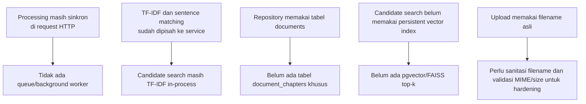

Dokumen ini sengaja menggambarkan kondisi backend yang ada sekarang, bukan rancangan ideal fase berikutnya.
